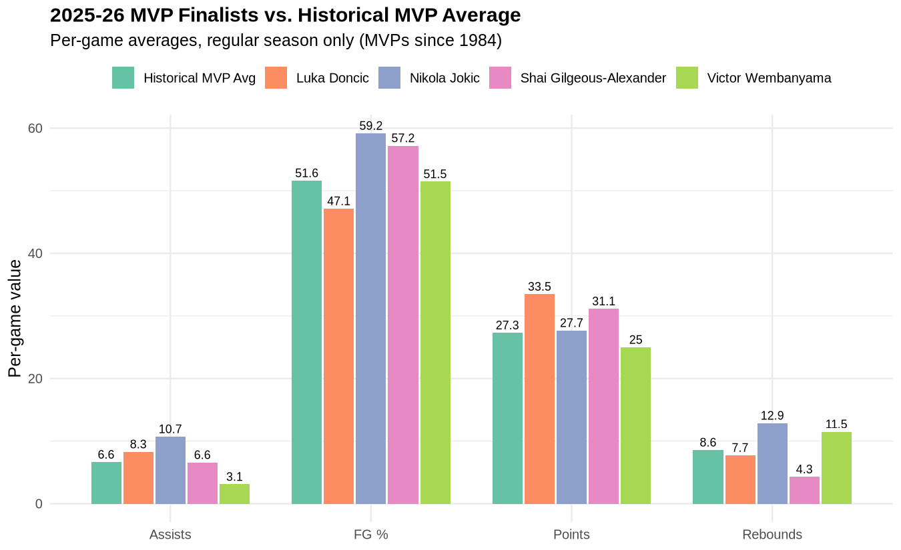
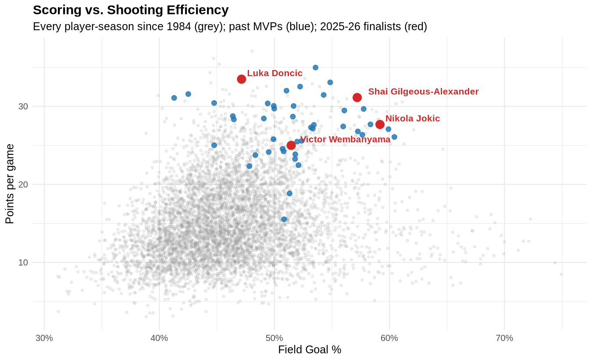
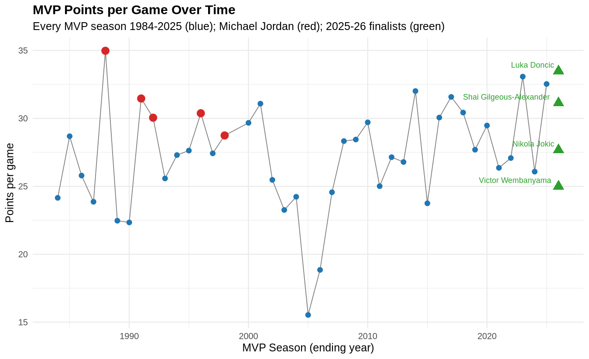
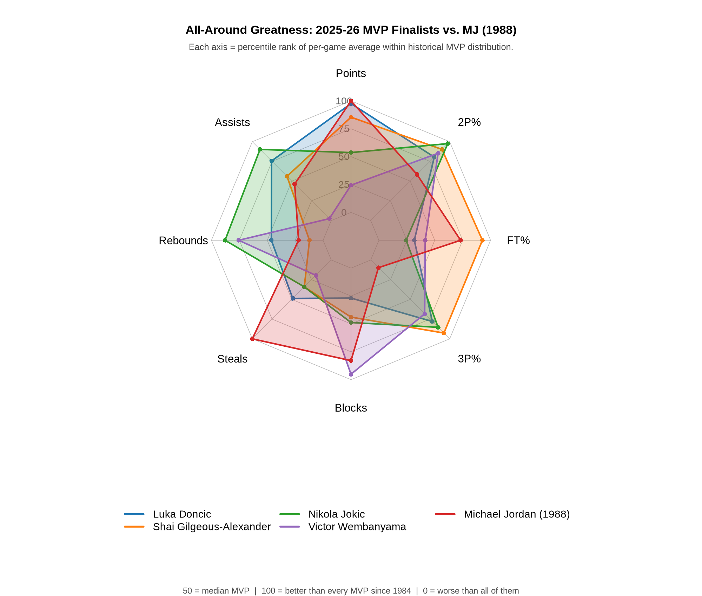

# NBA MVP Candidate Comparison — Final Project (R)

**Author:** Jim · **Course:** Data Analytics with R · **Date:** April 2026

## 1. Project Overview & Goals

This project uses historical NBA box-score data to evaluate the 2025-26
MVP finalists — **Nikola Jokić, Shai Gilgeous-Alexander, Luka Dončić,
and Victor Wembanyama** — against every previous MVP winner in NBA
history since 1984 (the modern statistical era), with a specific look at
how they stack up against **Michael Jordan**.

**Research questions:**

1. How do this year's finalists compare to the average historical MVP on
   the core stats voters weigh?
2. Is the finalists' scoring statistically distinguishable from the
   historical MVP average?
3. Given box-score inputs, how predictable is MVP-level scoring — and
   which finalist over- or under-produces relative to that model?

## 2. Dataset

- **Source:** Kaggle — [Historical NBA Data and Player Box Scores](https://www.kaggle.com/datasets/eoinamoore/historical-nba-data-and-player-box-scores) by Eoin A. Moore.
- **Main file:** `PlayerStatistics.csv` — **1,667,954 game-level rows** with one row per player per game, covering every regular-season and playoff game from **November 1946 through April 2026**.
- **Why this dataset:** Updated through the current season, includes every stat MVP voters weigh (points, assists, rebounds, steals, blocks, shooting splits), and is large enough for a meaningful historical comparison. Different from any dataset used in previous courses of the program.

> The raw `.csv` file (323 MB) is too large for GitHub and is excluded via `.gitignore`. Download it from the Kaggle link above to reproduce locally.

## 3. How to Run

```bash
# From inside this folder
Rscript "Final Project - NBA MVP Comparison.R"
```

**Required packages:** `readr`, `dplyr`, `ggplot2`, `scales`, `fmsb`, `tidyr`. The script writes 4 visualizations to `plots/` in about a minute.

## 4. Analysis Walkthrough (mapped to rubric)

### 4.1 Data Ingestion

`read_csv()` with `col_select` reads only the 11 columns the analysis
needs, keeping the load fast on the 323 MB file.

### 4.2 Data Cleaning *(rubric: missing data, types, outliers, duplicates — documented)*

- **Type coercion.** Every numeric stat is forced to `numeric` via `as.numeric()` to catch columns where R's CSV parser inferred a character type from stray non-numeric values.
- **Missing values.** Rows with `NA` or zero minutes (DNPs) are dropped. Shooting percentages that are `NA` because a player took zero attempts are coerced to 0.
- **Duplicates.** Rows are de-duplicated on `(player, game date)` as a safety check.
- **Outliers / unfair comparisons.** A two-layer filter (50+ games played, 25+ minutes per game) screens out injury-shortened seasons and specialist roles that would otherwise produce inflated per-game leaderboard entries.
- **Unicode normalization.** Accented names like "Luka Dončić" are transliterated to ASCII so joins against the MVP winner list work cleanly.

### 4.3 Data Manipulation (dplyr) *(rubric: at least 2 operations)*

The script uses **five** dplyr operations — the rubric only requires two:

- **`filter`** — Regular Season only, drops DNPs, and the 50-game / 25-MPG role floor.
- **`mutate`** — builds `player`, `game_date`, and `season` (using ending-year convention so Oct 2025 counts as the 2025-26 season).
- **`group_by` + `summarise`** — collapses 1.25 million game rows into roughly 7,000 player-season per-game averages.
- **`select`** — reorders columns for readability.
- **`arrange`** — by season descending, then by points descending.

### 4.4 Descriptive Statistics *(rubric: at least 2 methods)*

For every key stat across every MVP-winning season since 1984, the
script reports **mean, median, and standard deviation** (three methods,
rubric needs two):

| Stat              | Mean | Median | Std. Dev. |
|-------------------|------|--------|-----------|
| Points per game   | 27.3 | 27.3   | 4.5       |
| Assists per game  | 6.6  | 5.9    | 2.7       |
| Rebounds per game | 8.6  | 8.0    | 2.7       |
| FG%               | .516 | .516   | .046      |

These give us the benchmark each finalist is compared against.

### 4.5 Hypothesis Test *(rubric: at least 1)*

**One-sample t-test.** Is the finalists' scoring statistically different
from the historical MVP mean PPG?

- **H₀:** mean(finalist PPG) = 27.29 (the historical MVP mean since 1984)
- **H₁:** mean(finalist PPG) ≠ 27.29
- **Sample:** Luka 33.5, SGA 31.1, Jokić 27.7, Wemby 25.0 → sample mean 29.3
- **Result:** **t = 1.08, df = 3, p = 0.358.** With only four data points the test has little statistical power, but the result tells us we cannot meaningfully distinguish the finalists' scoring from the historical MVP average — they are scoring at "MVP-normal" levels, exactly as expected for an MVP race.

### 4.6 Linear Regression *(rubric: implement + interpret)*

`points ~ minutes + assists + rebounds + fg_pct` fit on every MVP-winning season since 1984 (n = 41).

- **R² = 0.22** — once you've filtered to MVP-caliber seasons, traditional box-score stats only weakly predict who scores more, because everyone in the pool is elite. A real finding worth calling out.
- The only coefficient that reaches p < 0.05 is **assists (negative)** — MVPs who pass more score slightly less, consistent with the role split between scorer-MVPs (Jordan, Harden) and playmaker-MVPs (Nash, Jokić).
- **Predicted vs. actual PPG for the finalists:**

  | Finalist                  | Actual | Predicted | Delta  |
  |---------------------------|-------:|----------:|-------:|
  | Luka Dončić               |  33.5  |   27.3    | **+6.2** |
  | Shai Gilgeous-Alexander   |  31.1  |   28.2    | **+3.0** |
  | Nikola Jokić              |  27.7  |   25.8    | **+1.8** |
  | Victor Wembanyama         |  25.0  |   29.4    | **−4.4** |

  Luka and SGA are creating shots the model doesn't predict from their other stats. Wemby, by contrast, is *under-producing* on points relative to what his minutes/assists/rebounds/FG% would suggest — his MVP case is built on defense, not scoring.

## 5. Data Visualizations *(rubric: at least 3 with title, labels, legends, formatting)*

The script produces **four** visualizations, all saved to `plots/`. Each is built with `ggplot2` (the radar uses the `fmsb` package). All have titles, axis labels, legends, and clear formatting.

### 5.1 Finalists vs. Historical MVP Average



Grouped bar chart comparing each finalist to the historical MVP average across four core stats. **Takeaway:** Jokić beats the historical MVP average in every category. Luka and SGA out-score the MVP average but trail in rebounds. Wemby leads in rebounds and matches the MVP average for FG%, but is below average on scoring and assists.

### 5.2 Scoring vs. Shooting Efficiency



Scatter plot of every player-season since 1984 (grey), with historical MVP-winning seasons in blue and the 2025-26 finalists labeled in red. **Takeaway:** All four finalists land cleanly inside the MVP cluster in the upper-right — confirming they're producing at MVP-tier levels.

### 5.3 MVP PPG Timeline



Scoring history of every MVP winner since 1984. Michael Jordan's five MVP seasons are highlighted in red — his 1988 MVP (35.0 PPG) sits above every other modern MVP. The 2025-26 finalists are in green on the right edge. **Takeaway:** Luka's 33.5 PPG is the closest any modern MVP candidate has come to MJ's 1988 scoring line.

### 5.4 All-Around Greatness Radar (finalists vs. MJ 1988)



Radar across 8 axes — five volume stats (Points, Assists, Rebounds, Steals, Blocks) and three efficiency stats (3P%, FT%, 2P%). FG% is intentionally excluded because it's a weighted blend of 2P% and 3P% — including it would double-count shooting. Each axis is the percentile rank within the historical MVP-season distribution, so a player who fills the chart is producing above-MVP across the board. MJ's 1988 MVP season is overlaid in red as the GOAT benchmark. **Takeaway:** Jokić's green polygon encloses the most area (the most "all-around" finalist). MJ's red polygon is maxed on Points and Steals but pinched on Assists and Rebounds — classic alpha-scorer shape. Wemby's purple polygon is maxed on Blocks but pinched on Assists. Each finalist literally has a different geometric shape — a different *kind* of MVP case.

## 6. Key Insights

1. **Jokić has the most well-rounded MVP case.** He beats the historical MVP average on every per-game stat in the analysis except blocks, and his radar shape encloses the most area of any finalist.
2. **Luka is 2026's best pure scorer.** At 33.5 PPG he's the closest any modern player has come to MJ's 1988 peak (35.0 PPG), and the regression flags him as the biggest "shot-creator" — over-producing on points by 6.2 PPG relative to what his other stats predict.
3. **Wemby is 2026's only real defensive MVP case.** His 3.08 BPG is by far the highest in the finalist group; he's the only one whose radar maxes the Blocks axis. His scoring is below the MVP norm — he's a different *kind* of MVP candidate from the other three.
4. **Statistical indistinguishability.** The t-test (p = 0.358) tells us we can't meaningfully distinguish the finalists' scoring from the historical MVP average. The MVP race will come down to which version of MVP-caliber the voters value most — volume scorer (Luka), efficiency specialist (SGA), rim protector (Wemby), or all-around (Jokić).

## 7. Project Reflection

**What went well.** Building the analysis as a clean ingest → clean → aggregate → analyze pipeline made it trivial to layer in new asks (adding Wembanyama as a fourth finalist, tightening the games/MPG filter) without rewriting upstream code.

**Challenge.** The NBA tracked different stats in different eras (blocks/steals only since 1974, 3PT% only since 1980), and player names sometimes appear with accented characters. Both required careful handling: limiting the comparison to MVPs since 1984 to keep stat coverage consistent, and transliterating names to ASCII before joining against the MVP winner list. An earlier version had data quality issues that caused `lm()` to silently drop rows and return garbage — a reminder to always check for NAs before trusting model output.

**If I continued the project, two next steps:**

1. **Playoff carry-over analysis.** The dataset includes playoff box scores; I'd extend the analysis to weight playoff performance separately and ask the classic "clutch MVP" question.
2. **Era-adjusted GOAT ranking.** Cumulate stats over a player's full career, normalize against the top-100 players of each player's own era, and produce a defensible GOAT top-10 — basically applying the same methodology to careers instead of single seasons.

## 8. AI Acknowledgment

Per course policy: Claude (Anthropic) was used as an assistant in
designing the pipeline structure, debugging R errors, and refining the
visualizations. All analysis decisions, the dataset choice, and the
interpretations of results are my own.

## 9. File Listing

| File                                             | Purpose                              |
|--------------------------------------------------|--------------------------------------|
| `Final Project - NBA MVP Comparison.R`           | Main analysis script (~190 lines)    |
| `plots/01_finalists_vs_mvp_average.png`          | Viz 1: bar chart                     |
| `plots/02_scoring_vs_efficiency.png`             | Viz 2: scatter                       |
| `plots/03_mvp_ppg_timeline.png`                  | Viz 3: timeline                      |
| `plots/04_all_around_radar.png`                  | Viz 4: radar                         |
| `README.md`                                      | This file                            |
